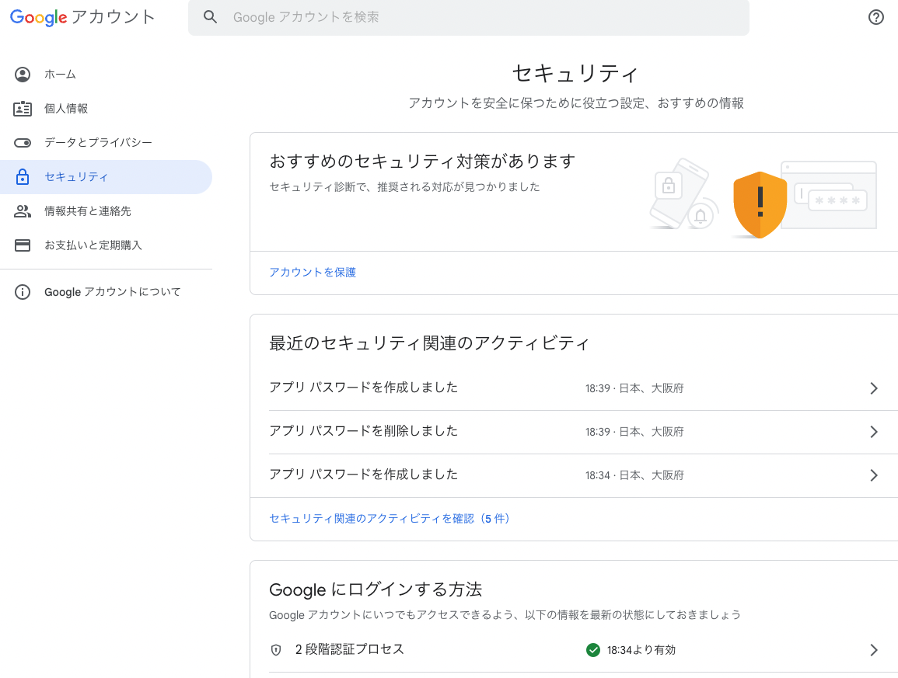
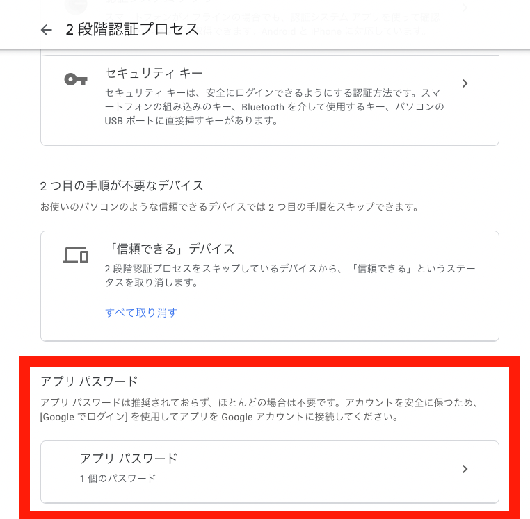
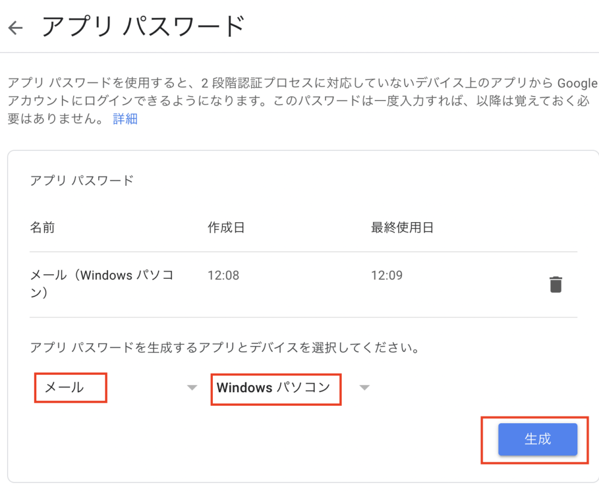
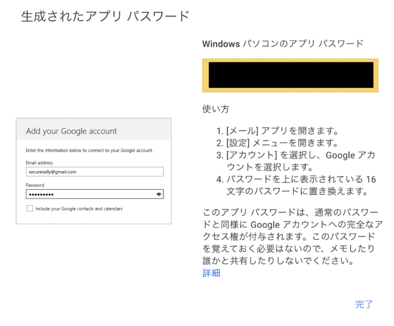

# Python Send Email Library
Pythonで書かれたメール送信用ライブラリです。

## インストール
このライブラリをインストールするには、pipコマンドを使います。

```bash
pip install git+https://github.com/rikuto125/python-send-email.git
```

## 使い方：メールを送信する
外部のSMTPサーバーの設定
このライブラリは、外部のSMTPサーバーを利用してメールを送信します。SMTPサーバーの情報を以下のように設定してください。
SendEmailUseCaseクラスを使ってメールを送信します。以下は、SendEmailUseCaseクラスの使い方の例です。
```python
from adapters.smtp_adapter import SmtpAdapter

#下の方にある各種メールサーバとサービスの設定を参照
smtp_host = 'smtp.example.com'
smtp_port = 587
smtp_username = 'your_username'
smtp_password = 'your_password'

smtp_adapter = SmtpAdapter(smtp_host, smtp_port, smtp_username, smtp_password)


from usecases.send_email import SendEmailUseCase

send_email_usecase = SendEmailUseCase(smtp_adapter)

from_address = 'from@example.com'
to_address = 'to@example.com'
subject = 'Test Email'
body = 'This is a test email'

send_email_usecase.execute(from_address, to_address, subject, body)
```

SendEmailUseCaseクラスのexecuteメソッドに、from_address、to_address、subject、bodyを引数に渡して、メールを送信します。

# 環境変数を使ってSMTPサーバーの情報を設定する(番外編)
SmtpAdapterクラスの初期化時に、SMTPサーバーの情報を渡す際に、環境変数を使って設定することができます。

```python
from adapters.smtp_adapter import SmtpAdapter
import os

smtp_host = os.environ.get('SMTP_HOST')
smtp_port = os.environ.get('SMTP_PORT')
smtp_username = os.environ.get('SMTP_USERNAME')
smtp_password = os.environ.get('SMTP_PASSWORD')
from_address = os.environ.get('FROM_ADDRESS')
to_address = 'to@example.com'
subject = 'Test Email'
body = 'This is a test email'

smtp_adapter = SmtpAdapter(smtp_host, smtp_port, smtp_username, smtp_password)
```

環境変数を使ってSMTPサーバーの情報を設定する場合、以下のように環境変数を設定しておく必要があります。

.env
```bash
SMTP_HOST='smtp.example.com'
SMTP_PORT=587
SMTP_USERNAME='your_username'
SMTP_PASSWORD='your_password'
FROM_ADDRESS='hoge@hogehoge'
```

# 各種メールサーバとサービスの設定
## AWS SESを使ってメールを送信する
```python
smtp_host = 'email-smtp.us-east-1.amazonaws.com'
smtp_port = 587
smtp_username = 'your_smtp_username'
smtp_password = 'your_smtp_password'
```

## Gmailを使ってメールを送信する

### smtpのpasswordを取得する

https://x.gd/IXNEe を参照しながら2段階認証をonにする



その後2段階認証の設定画面にもう一度アクセスして、
一番下にあるアプリパスワードを発行する



アプリをメールにデバイスはお好きなデバイスを選択して、パスワードを発行する


発行後黒で隠しているところをコピーする
(passwordは一度しか表示されないので注意!!)



smtp_password= に貼り付ける

```python
smtp_host = 'smtp.gmail.com'
smtp_port = 587
smtp_username = 'your_gmail_address' // ここはgmailの@の前まで
smtp_password = 'your_gmail_password' // 上のsmtpのpasswordを貼り付け
```

## Xserverを使ってメールを送信する
```python
smtp_host = 'smtp.xserver.ne.jp'
smtp_port = 587 または 465
smtp_username = 'your_xserver_username'
smtp_password = 'your_xserver_password'
```

## Azureを使ってメールを送信する
```python
smtp_host = 'smtp.office365.com'
smtp_port = 587
smtp_username = 'your_azure_username'
smtp_password = 'your_azure_password'
```

## Dockerで動かす場合のcomposeファイルの例
```yaml
version: '3.7'
services:
  app:
    build: 
      context: .
      dockerfile: Dockerfileのパス
    environment:
      - SMTP_HOST=smtp.example.com
      - SMTP_PORT=587
      - SMTP_USERNAME=your_username
      - SMTP_PASSWORD=your_password
```


